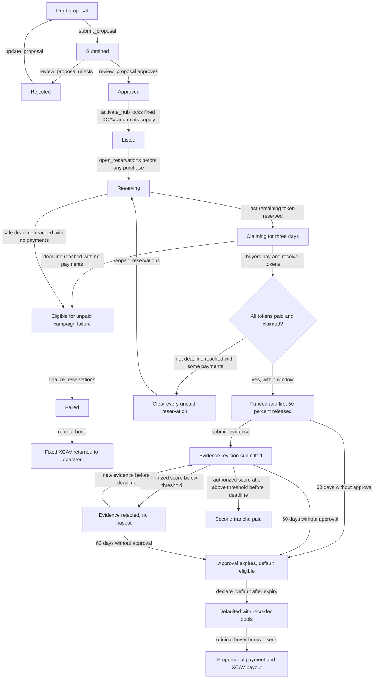
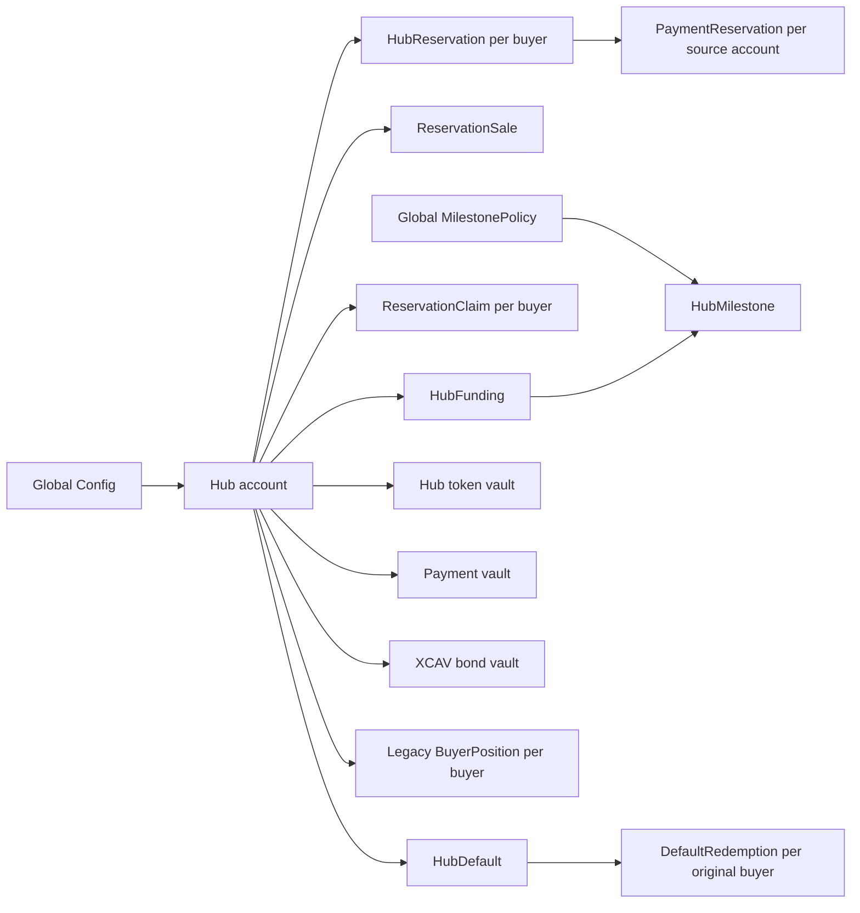
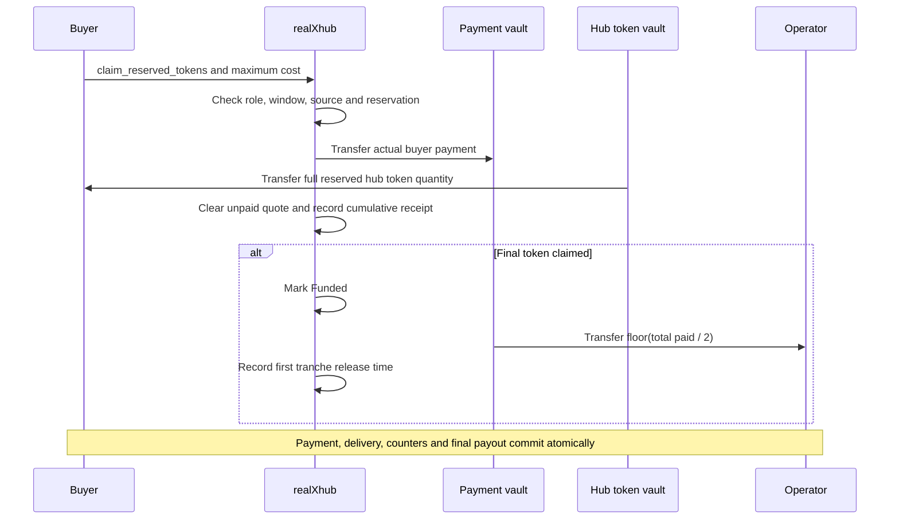
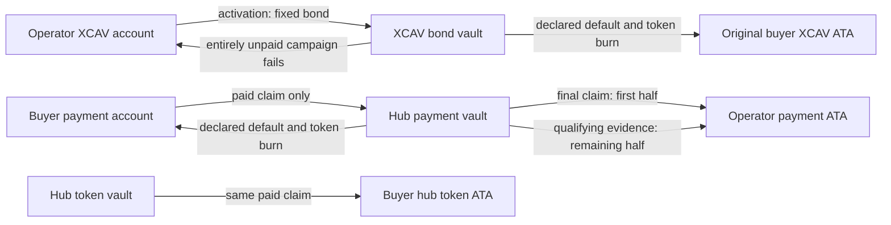
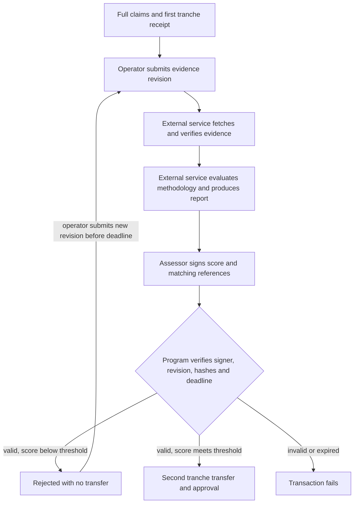
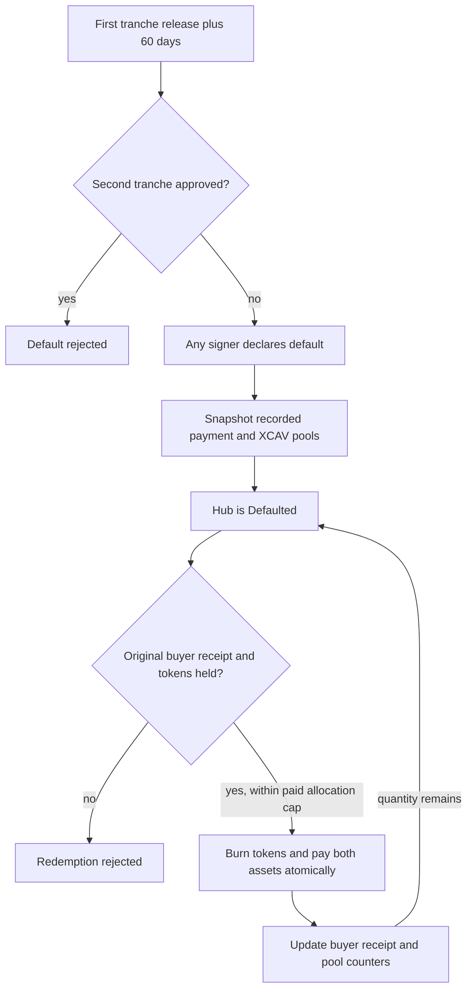
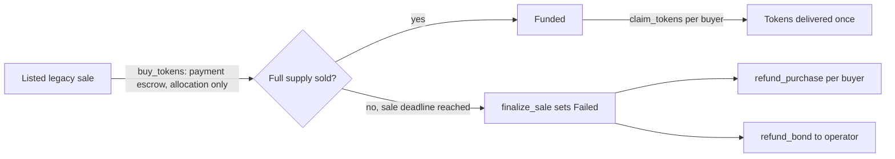

# realXhub implementation and lifecycle analysis

This document explains the current realXhub program, how its state and assets move, what has been implemented from the requested hub funding flow, and what remains incomplete. It is intended for the project owner and developers integrating the program.

The reservation, paid claiming, two payment tranches and default redemption paths are implemented. After 60 days without approval, original buyers can surrender tokens by burning them for proportional remaining payment and the fixed XCAV bond already escrowed. The program does not calculate probability itself or implement oracle based 30 percent bond maintenance. The user resumed default settlement while collateral valuation remains deferred. Two verified setup risks remain before real funding.

## Scope and source snapshot

| Item | Reviewed value |
|---|---|
| Repository | `/Users/ganesh/Documents/realXhub-colosseum` |
| Program scope | `programs/realxhub` only, with dependency interfaces inspected where needed |
| Branch | `realxhub-proposal-token-sale` |
| HEAD | `81006a1a81bd9c6c7325de719e899046a387e95b` |
| Review date | 3 October 2026 |
| Declared program ID | `HbHu1p5KJJsCehawX5NBdqZXuGzHyqyPAsZcYUUz21b` |
| Source state | Includes existing uncommitted and untracked implementation files, not just HEAD |
| Public interface | 24 instructions and 12 program account types |

The Rust source is the authority for implemented behavior. Existing README text is supporting context and contains some older descriptions. Human decisions from this conversation are recorded separately from the code; they do not establish that a feature exists. This analysis does not establish deployment status or constitute an independent security audit.

## Requested behavior and current completion

| Requested behavior | Status | Exact current boundary |
|---|---|---|
| Soft reservation of hub tokens and stablecoin quotes | Implemented in the program | No payment or hub token transfer at reservation; account rent and transaction fees still apply. |
| Frontend shows stablecoins as reserved | Outside this implementation | The ledger exists, but this workspace has no hub frontend implementing that display. |
| Last token reserved starts three days of paid claiming | Implemented | The last reservation starts the window atomically; duration is exactly 259,200 seconds. |
| Reopen unpaid allocations after partial claiming | Implemented | Expired unpaid records must be cleared first. Existing payments and delivered tokens remain intact. |
| First 50 percent released on the last paid claim | Implemented | The final claim releases the tranche atomically to the recorded operator. |
| Evidence approval by probability of success, without a community vote | Program side implemented | An authorized signer attests a score; the program compares it with an immutable threshold. |
| Automated evidence analysis and probability calculation | Missing integration | No evidence fetcher, scoring worker, calibrated model or report publisher is implemented here. |
| Second 50 percent released on qualifying approval | Implemented | Approval and transfer occur in the same transaction, before the strict deadline. |
| Approval within 60 days | Implemented as a cutoff | Exactly 5,184,000 seconds from first tranche release; no grace period. |
| Remaining payment and XCAV paid in exchange for tokens after default | Implemented | Permissionless default declaration after expiry; atomic token burn and both recorded pool payouts. |
| Only original buyers may redeem after default | Implemented | Original paid receipt and buyer signature required; cumulative burn capped at purchased quantity. |
| XCAV worth 30 percent of proposal value | Deferred and absent | Current collateral is a fixed XCAV token amount, snapshotted from config. |
| Maintain that value through price changes and top ups | Deferred and absent | Oracle mint/feed details remain to be supplied; no repricing or top up mechanism. |

At expiry, approval is blocked and default becomes available. A transaction must declare default; each original buyer then submits a token burn and redemption transaction. Time passing alone does not execute payouts.

## Main reservation lifecycle


[Download scalable lifecycle diagram](/Users/ganesh/Documents/realXhub-colosseum/programs/realxhub/docs/LIFECYCLE.svg). The editable diagrams below explain each path in more detail.

The following diagram shows current behavior. Evidence phases are separate milestone records; they do not introduce additional `HubStatus` values.



An expired reopened reservation period with previous paid claims can also be cleaned up and renewed. The diagram's failure branch applies only to entirely unpaid campaigns. Time passing does not execute cleanup, reopening or failure transactions.

Source: [proposal.rs](/Users/ganesh/Documents/realXhub-colosseum/programs/realxhub/src/instructions/proposal.rs), [reservation.rs](/Users/ganesh/Documents/realXhub-colosseum/programs/realxhub/src/instructions/reservation.rs), [reservation_claim.rs](/Users/ganesh/Documents/realXhub-colosseum/programs/realxhub/src/instructions/reservation_claim.rs), and [milestone.rs](/Users/ganesh/Documents/realXhub-colosseum/programs/realxhub/src/instructions/milestone.rs).

## Actors and authorization

| Actor | Powers | Important restrictions |
|---|---|---|
| Program upgrade authority | Initializes `Config` once | The supplied program data must identify this signer as upgrade authority. |
| Recorded config authority | Initializes `MilestonePolicy` once | This is the authority recorded at config creation; policy initialization does not reread current upgrade authority. |
| Configured proposal verifier | Approves or rejects proposals | Must sign for the exact submitted revision and metadata hash; cannot review their own hub. |
| Recorded operator | Creates, updates, submits and activates a hub; opens reservations; submits evidence; receives tranches | Proposal operations, activation and opening require current compliant regional operator role and region ownership. Evidence submission requires the recorded operator signature, but does not repeat those role or region checks. |
| Compliant investor | Buys in the legacy flow, reserves and pays claims in the reservation flow | Reuses `RealEstateInvestor`; each new payment requires current compliance. |
| Configured assessor | Submits a probability score and report reference | Must sign; cannot assess their own hub; cannot substitute a stale revision or hash. |
| Any transaction signer | Executes permitted expiry cleanup, reopening, failure finalization, default declaration or standalone first tranche release | State and time checks still apply. Permissionless execution does not allow choosing the payout recipient. |
| Original legacy buyer or failed sale operator | Claims legacy allocations or recovers an existing eligible refund | Those recovery paths deliberately have no current compliance gate. |
| Original paid reservation buyer | Redeems a defaulted hub by burning tokens | Original receipt required; cannot exceed purchased allocation; no current compliance gate. |

Identity verification and evidence analysis take place outside this program. A compliant role account is an input to the checks; the program does not perform identity verification itself. There is no community voting instruction.

Source: account constraints in [initialize.rs](/Users/ganesh/Documents/realXhub-colosseum/programs/realxhub/src/instructions/initialize.rs), [proposal.rs](/Users/ganesh/Documents/realXhub-colosseum/programs/realxhub/src/instructions/proposal.rs), [purchase.rs](/Users/ganesh/Documents/realXhub-colosseum/programs/realxhub/src/instructions/purchase.rs) and [milestone.rs](/Users/ganesh/Documents/realXhub-colosseum/programs/realxhub/src/instructions/milestone.rs).

## Accounts and asset custody

All seed expressions below are under the realXhub program ID. `id` means the hub ID encoded as eight little endian bytes; `buyer` and token account keys are their public key bytes. Role and region accounts belong to their existing dependency programs.

| Program account | PDA seeds | Main recorded data |
|---|---|---|
| `Config` | `["config"]` | Authority, proposal verifier, XCAV/payment mints, fixed bond amount, next hub ID, bump |
| `Hub` | `["hub", id]` | Operator, region, proposal metadata/revision/status, fixed sale terms, bond snapshot, mint, paid/sold/claimed/refunded counters |
| `BuyerPosition` | `["position", id, buyer]` | Legacy purchased quantity, paid amount and one-time settlement flag |
| `ReservationSale` | `["reservation_sale", id]` | Pending unpaid quantity and current three-day claim timestamps |
| `HubReservation` | `["hub_reservation", id, buyer]` | Unpaid quantity, quoted payment and original bound payment account |
| `PaymentReservation` | `["payment_reservation", payment_account]` | Aggregate unpaid hub quotes against one source token account |
| `ReservationClaim` | `["reservation_claim", id, buyer]` | Cumulative paid and delivered quantity, actual payment and most recent claim time |
| `HubFunding` | `["funding", id]` | First tranche amount, one-time release flag and release time |
| `MilestonePolicy` | `["milestone_policy"]` | Global assessor, threshold, methodology URI/hash and bump |
| `HubMilestone` | `["milestone", id]` | Current evidence revision/reference, fixed deadline, assessment result/reference, second tranche amount/flag/time |
| `HubDefault` | `["default", id]` | Fixed payment/XCAV pools, supply denominator, default/deadline timestamps and aggregate redemption counters |
| `DefaultRedemption` | `["default_redemption", id, buyer]` | Cumulative original-buyer tokens burned and payment/XCAV received |

Separate SPL Token accounts hold assets:

| Asset account | Seeds or address | Custody |
|---|---|---|
| Hub mint | `["hub_mint", id]` | Zero decimal fixed supply mint; minting authority removed at activation |
| Hub token vault | `["token_vault", id]` | Undelivered hub tokens; hub PDA is authority |
| Payment vault | `["payment_vault", id]` | Actual buyer payments awaiting permitted release or legacy refund |
| XCAV bond vault | `["bond_vault", id]` | Fixed operator bond; separate from payments |
| Buyer hub token account | Canonical associated token account | Delivered transferable tokens owned by buyer |
| Operator payment account | Canonical associated token account | Fixed destination of both funding tranches |



The arrows describe logical relationships, not token transfers. Reservations and receipts hold data, not stablecoins. A claim receipt tracks original purchases, not the current holder of transferable tokens.

Source: [state.rs](/Users/ganesh/Documents/realXhub-colosseum/programs/realxhub/src/state.rs) and [constants.rs](/Users/ganesh/Documents/realXhub-colosseum/programs/realxhub/src/constants.rs).

## Proposal and activation

`initialize_config` fixes the proposal verifier, payment mint, XCAV mint and positive bond amount. The mints must differ and have no freeze authority. The account types support classic SPL Token rather than Token 2022. Naming a payment mint does not itself prove that the asset is a stablecoin; deployment must select the intended mint.

`create_proposal` assigns the next numeric hub ID and creates revision 1 in `Draft`. Its terms include a nonempty name of at most 64 UTF-8 bytes, a nonempty metadata URI of at most 200 bytes, nonzero metadata hash, positive token price, positive supply and positive sale duration. `token_price * token_supply` must fit in `u64`. The fixed bond amount is snapshotted when the draft is created; it is not calculated from the proposal value.

Only `Draft` and `Rejected` proposals can be edited. Editing increments revision, returns to `Draft` and clears previous review details. Submission requires `Draft` and freezes the version for review. Review requires `Submitted`, the configured verifier, matching revision and hash, and a verifier distinct from the operator. Approval and rejection are verifier decisions; proposal review does not fetch the metadata document or run a model.

Activation requires `Approved`, renewed operator eligibility and region ownership, and `bond_amount <= max_bond`. It atomically transfers the fixed XCAV bond, creates the hub mint and all three vaults, mints the full supply to the token vault, removes minting authority and sets `Listed`. The sale deadline is activation time plus the submitted sale duration. The bond is deposited only after approval, so rejected applications have no deposited bond to refund.

Source: [proposal.rs](/Users/ganesh/Documents/realXhub-colosseum/programs/realxhub/src/instructions/proposal.rs:73) and [activation.rs](/Users/ganesh/Documents/realXhub-colosseum/programs/realxhub/src/instructions/activation.rs:52).

## Soft reservation behavior

Opening reservations is an explicit operator action after activation. It requires `Listed`, an unexpired sale, and zero sold, claimed and paid counters. It creates `ReservationSale` and sets `Reserving`. A hub with a legacy purchase cannot be converted.

For quantity `q` at payment price `p`, the quote is `q * p` in payment mint base units. The program checks positive quantity, remaining supply and the caller's `max_total_cost`. An investor may add to the same reservation using the same payment account.

The balance check includes all unpaid realXhub quotes against that source account:

```text
existing unpaid hub quotes + new quote <= current source account balance
delivered quantity + pending reserved quantity <= fixed hub supply
```

This limits simultaneous promises when reservations are created, but it does not freeze the account or guarantee later payment. The buyer can spend those stablecoins afterward. It also does not include property token promises from the separate realXmarket program; a frontend combining the two systems must account for that distinction.

When the full remaining supply is reserved, that same transaction sets `Claiming` and fixes `claim_deadline = now + 259200`. A last reservation just before the original sale deadline still gets three full days. No further reservation or cancellation can reset that round.

`cancel_reservation` clears the whole unpaid position while status is `Reserving`. There is no current role gate or separate timestamp guard on cancellation; it can clear an expired promise while the hub still has that status. It transfers no refund because payment never left the wallet. The record remains allocated and bound to the original payment account, including after cancellation or payment; it is not closed to recover rent or enable switching to another source account.

Source: [reservation.rs](/Users/ganesh/Documents/realXhub-colosseum/programs/realxhub/src/instructions/reservation.rs:84).

## Paid claiming and partial completion

`claim_reserved_tokens` requires `Claiming`, `now < claim_deadline`, a nonempty reservation, a compliant investor, the original source payment account and a cost within the buyer's maximum. The quoted cost must still equal the fixed token price multiplied by that reserved quantity. One call pays and claims the entire current reservation; there is no partial quantity parameter.



After a successful claim, unpaid quantities and quotes decrease; `tokens_sold`, `tokens_claimed` and `total_paid` increase. In this flow, sold and claimed quantities remain equal. `ReservationClaim` accumulates purchases if the same buyer participates again in reopened rounds.

At three-day expiry, anyone can clear each unpaid reservation. If some tokens were paid for, `reopen_reservations` requires all unpaid positions to have been cleared, `0 < tokens_sold < supply`, and `tokens_claimed == tokens_sold`. It preserves paid funds and delivered tokens, then opens only `supply - tokens_sold` for a new period of the original sale duration. Filling that remainder starts a new three-day window.

A partially paid campaign cannot become `Failed` through reservation finalization and cannot return the operator bond. It may keep reopening, including after a reopened reservation period expires without filling. There is currently no paid buyer refund or maximum campaign lifetime for this path. This is an economic liveness limitation of the accepted reopening design.

If no buyer has ever paid or received tokens, expiry allows `finalize_reservations` to set `Failed`. The recorded operator may then recover the fixed bond once. Unpaid cleanup can occur before or after finalization; it need not await the buyer's signature or the continued existence of the source token account.

Source: [reservation_claim.rs](/Users/ganesh/Documents/realXhub-colosseum/programs/realxhub/src/instructions/reservation_claim.rs:83) and [reservation.rs](/Users/ganesh/Documents/realXhub-colosseum/programs/realxhub/src/instructions/reservation.rs:328).

## Payment tranches and accounting

Let `T = token_price * token_supply`, expressed in the payment mint's smallest units. Completed funding requires the full supply sold and claimed, exact recorded payment `T`, and no refunds.

```text
first tranche  = floor(T / 2)
second tranche = T - first tranche
approval deadline = first tranche release time + 5184000 seconds
```

An odd base unit goes to the second tranche. With a one-unit target, first release transfers zero units but records a valid release and starts the deadline. Calculations use recorded payment, not the vault's balance. Unsolicited deposits do not enlarge operator entitlement and have no current recovery instruction.



The first tranche is part of the final claim transaction. The final buyer pays account rent if the operator payment ATA must be created. If payout fails, that final buyer's payment, token delivery, records and funded transition all roll back; previous successful claims remain intact.

`release_first_tranche` also supports fully paid and claimed reservation hubs from before automatic release. Any signer may pay its costs, but the operator recipient is fixed. It requires the reservation sale account, no pending unpaid reservations and the shared receipt's unreleased flag. It cannot release legacy sale escrow or duplicate an automatic release.

The second tranche is transferred in the qualifying assessment transaction. The assessor pays to recreate the operator ATA if necessary. A transfer failure rolls back approval and release, allowing retry. The XCAV bond is untouched by both tranches. There is no successful-hub bond withdrawal.

Source: [funding.rs](/Users/ganesh/Documents/realXhub-colosseum/programs/realxhub/src/instructions/funding.rs:67), [reservation_claim.rs](/Users/ganesh/Documents/realXhub-colosseum/programs/realxhub/src/instructions/reservation_claim.rs:201) and [milestone.rs](/Users/ganesh/Documents/realXhub-colosseum/programs/realxhub/src/instructions/milestone.rs:229).

## Evidence and probability approval

The config authority initializes one global immutable policy: assessor public key, threshold from 1 to 10,000 basis points, and methodology URI/hash. There is no default production threshold, per-hub policy selection or policy update/rotation instruction. The 7,000 basis point threshold used in tests is test data.

The operator can submit evidence only after full payment, full token delivery and first tranche release. Each evidence record carries a nonempty URI of at most 200 UTF-8 bytes and a nonzero hash. Submission increments revision, sets `Submitted`, and clears the previous assessment. Pending or rejected evidence can be replaced before the deadline. Replacing evidence never extends the deadline.

Assessment requires the configured assessor signature and the exact current revision, evidence hash and methodology hash. The score must be between 0 and 10,000 inclusive, and the report also needs a valid URI/hash. The contract computes:

```text
approved = probability_bps >= approval_threshold_bps
```

A below-threshold assessment records `Rejected` without payment. That decision cannot be changed in place; the operator must submit a new revision. An at-threshold or higher score atomically releases the remaining payment and records `Approved`. After payout, resubmission and repeated assessments are blocked.



The external service boxes describe integration still to be implemented, not existing worker code. The program checks references and signatures but cannot prove that a document was fetched, its bytes matched the supplied hash, a model ran, or the probability was calibrated. No voting is involved, but trust shifts to the assessor service and its signing key; a signed score can still be wrong or malicious.

Both submission and assessment require `now < first_release_time + 60 days`. Submitting on time is insufficient if approval arrives at or after the deadline. There is no grace, appeal, outage extension or alternate signer. Loss or unavailability of the immutable assessor key can prevent payout.

`Hub.status` remains `Funded` after approval and immediately after deadline expiry. `declare_default` changes an eligible hub to the appended `Defaulted` phase. The milestone status remains one of `Submitted`, `Rejected`, or `Approved`; it has no expiry phase. Clients must derive eligibility from the clock, show declared default from hub state, and distinguish full funding from successful second payout using the receipts.

Source: [milestone.rs](/Users/ganesh/Documents/realXhub-colosseum/programs/realxhub/src/instructions/milestone.rs:47) and [state.rs](/Users/ganesh/Documents/realXhub-colosseum/programs/realxhub/src/state.rs).

## Default declaration and original buyer redemption

At or after the strict 60-day deadline, any signer can invoke `declare_default`. It reuses the funded accounting/deadline validation, requires the recorded unrefunded bond, reads the canonical milestone if one exists and rejects any successful second-tranche approval. Absence of evidence or policy does not prevent settlement; an empty system-owned canonical milestone address is accepted as absent. The milestone account is not optional in the instruction, so a caller cannot hide an existing approved record.

The program snapshots two fixed pools into `HubDefault`: recorded payment less the already released first tranche, and the hub's recorded XCAV bond amount. Both vaults must cover those amounts. Direct donations do not increase either pool. The hub transitions to `Defaulted`, blocking evidence submission, assessment and ordinary failed-sale bond refund. Declaration does not burn or pay anything itself.

`redeem_default(hub_id, amount, min_payment_out, min_xcav_out)` requires the original buyer signature and `ReservationClaim`. It burns `amount` tokens from an account owned by that buyer for the correct hub mint, then pays payment and XCAV into their canonical associated token accounts. It creates recipients when needed, at the buyer's cost. Account creation, burn, both transfers and all counters commit atomically; a failed second transfer restores the first payment and burned tokens.

Cumulative redemption is capped at the buyer's cumulative paid claim quantity. Secondary holders with no original receipt cannot redeem. An original buyer who transferred tokens away must reacquire tokens before surrendering them, and purchasing additional tokens does not increase the original allocation limit. Current compliance is not required to recover an existing funded entitlement. There is no lost-token alternative or payment without surrender.

For each pool, partial redemptions use cumulative proportional floors:

```text
normal payout = floor(pool * new buyer redeemed quantity / original supply)
              - floor(pool * previous buyer redeemed quantity / original supply)
```

Multiplication uses `u128`, so `u64` token quantities do not overflow the intermediate product. Splitting a normal redemption into calls does not increase its entitlement. The transaction redeeming the final token in the whole hub receives the remaining base-unit rounding dust, ensuring full pool distribution when everyone redeems. That bounded dust allocation depends on call order. Minimum output arguments protect the caller's expected amount.



No timer automatically declares default or executes investor transactions. A keeper can declare; buyers must sign their own burns. Unredeemed shares remain escrowed if buyers never act or cannot recover tokens. The program distributes the fixed XCAV amount already locked, without claiming it is worth 30 percent. Oracle pricing and collateral top ups remain separate work.

Source: [default.rs](/Users/ganesh/Documents/realXhub-colosseum/programs/realxhub/src/instructions/default.rs) and [default tests](/Users/ganesh/Documents/realXhub-colosseum/programs/realxhub/tests/default.rs).

## Legacy paid sale behavior

The original flow is still available for hubs that remain `Listed`. Buyers pay immediately through `buy_tokens`, receiving an allocation in `BuyerPosition` rather than tokens. Selling the full supply sets `Funded`; each original buyer then calls `claim_tokens` once. Neither full sellout nor the last legacy claim releases a funding tranche in this implementation.



Legacy failures return each buyer's recorded payment and the operator's recorded bond once. Buyers never received transferable hub tokens before sellout, so failed sale refunds do not require recovering tokens. Revoked eligibility does not block these refunds or legacy funded claims. Payments and bonds for a successful legacy sale remain in escrow; the reservation funding instructions do not convert that flow.

Source: [purchase.rs](/Users/ganesh/Documents/realXhub-colosseum/programs/realxhub/src/instructions/purchase.rs).

## Complete instruction reference

All instruction signatures are declared in [lib.rs](/Users/ganesh/Documents/realXhub-colosseum/programs/realxhub/src/lib.rs). The table lists transaction signers; fees may also be paid by a transaction fee payer. Account initialization rents follow the payer constraints in each instruction.

| Instruction | Principal inputs | Required signer | Result and main gate |
|---|---|---|---|
| `initialize_config` | `ConfigParams { verifier, bond_amount }`, mints | Initial upgrade authority | Creates immutable configuration; validates distinct supported mints. |
| `create_proposal` | `region_id`, `ProposalParams` | Compliant owning operator | Creates `Draft`, revision 1, next numeric ID, bond snapshot. |
| `update_proposal` | `hub_id`, `ProposalParams` | Compliant owning operator | Edits `Draft` or `Rejected`, increments revision, clears review. |
| `submit_proposal` | `hub_id` | Compliant owning operator | `Draft` to `Submitted`. |
| `review_proposal` | `hub_id`, revision, metadata hash, approval boolean | Configured verifier | Exact submitted version to `Approved` or `Rejected`; self review prohibited. |
| `activate_hub` | `hub_id`, `max_bond` | Compliant owning operator | `Approved` to `Listed`, fixed bond and token/vault creation. |
| `buy_tokens` | `hub_id`, amount, maximum cost | Compliant investor | Legacy payment and allocation before sale deadline; sellout sets `Funded`. |
| `finalize_sale` | `hub_id` | Any signer | Expired `Listed` legacy sale to `Failed`. |
| `claim_tokens` | `hub_id` | Original legacy buyer | Deliver unsettled legacy allocation once in `Funded`. |
| `refund_purchase` | `hub_id` | Original legacy buyer | Return unsettled legacy payment once in `Failed`. |
| `refund_bond` | `hub_id` | Recorded operator | Return recorded bond once in `Failed`. |
| `open_reservations` | `hub_id` | Compliant owning operator | Unpurchased, unexpired `Listed` to `Reserving`. |
| `reserve_tokens` | `hub_id`, amount, maximum cost | Compliant investor | Adds unpaid quote; last remaining reservation starts `Claiming`. |
| `cancel_reservation` | `hub_id` | Reservation buyer | Clears whole unpaid quote in `Reserving`, with no token transfer. |
| `claim_reserved_tokens` | `hub_id`, maximum cost | Compliant reservation buyer | Pays and receives full allocation before claim deadline; final claim releases first half. |
| `release_reservation` | `hub_id`, buyer public key | Any signer | Clears one expired unpaid reservation, or one in `Failed`. |
| `release_first_tranche` | `hub_id` | Any signer | One-time first payout for fully funded reservation hub; fixed recipient. |
| `reopen_reservations` | `hub_id` | Any signer | Expired partially paid round, all unpaid promises cleared, to `Reserving`. |
| `finalize_reservations` | `hub_id` | Any signer | Expired entirely unpaid campaign to `Failed`. |
| `initialize_milestone_policy` | Assessor, threshold, methodology URI/hash | Recorded config authority | Creates immutable global assessment policy. |
| `submit_evidence` | `hub_id`, evidence URI/hash | Recorded operator | Creates/replaces evidence revision before 60-day cutoff. |
| `assess_evidence` | `hub_id`, revision, evidence/methodology hashes, score, report URI/hash | Configured assessor | Rejects or approves exact current revision; approval transfers second tranche atomically. |
| `declare_default` | `hub_id`, canonical milestone address including when absent | Any signer | Unapproved, fully funded reservation hub at/after 60-day deadline to `Defaulted`; snapshots recorded pools. |
| `redeem_default` | `hub_id`, quantity, minimum payment and XCAV outputs | Original paid buyer | Burns tokens and transfers both proportional payouts atomically, within the original allocation cap. |

The generated Anchor interface is at `target/idl/realxhub.json` after building. Paid claim builders must include operator recipient and funding records. `ClaimRecords` is a nested accounts group; its repeated buyer and hub are bound to the outer validated accounts. This grouping keeps validation within the SBF stack limit.

## Economic example

Assume a configured payment asset with six decimals, 1,000 hub tokens and a price of 100 payment units per token. These are explanatory inputs, not production settings.

| Stage | Buyers | Payment vault | Operator | XCAV bond vault |
|---|---|---|---|---|
| Activation | No hub tokens delivered | No buyer payment | Deposits configured fixed XCAV amount | Holds fixed token amount |
| All tokens reserved | Stablecoins remain in wallets | Still no buyer payment | No payment tranche | Unchanged |
| Some paid claims | Receives tokens for each actual payment | Accumulates actual payments | No tranche yet | Unchanged |
| Last paid claim | All 1,000 tokens delivered; total payment 100,000 | Retains 50,000 | Receives 50,000 | Unchanged |
| Qualifying approval | Buyer tokens unchanged | Pays remaining 50,000 | Receives second 50,000 | Still locked |
| 60-day expiry without approval | Buyer tokens unchanged until redemption | Remaining 50,000 available after default declaration | First 50,000 already paid | Recorded fixed amount available for redemption |
| Original buyers redeem after declaration | Tokens surrendered are permanently burned | Proportional residual payment distributed | No additional payment | Proportional recorded XCAV distributed |

Under the still-deferred 30 percent valuation design, a bond valued at 30,000 plus the remaining 50,000 would represent 80,000 in combined nominal value before price movement and costs. It would not refund the full original 100,000 because the first tranche was already delivered. Current redemption distributes the fixed XCAV token amount recorded for the hub, without assuming that valuation. Original buyer eligibility, token burning and payout rounding are now implemented.

## Verified review findings

### Purchase between activation and reservation opening

Activation sets `Listed`, which permits `buy_tokens`. If activation and opening are separate transactions, a compliant investor can purchase before the operator opens reservations. `open_reservations` then fails with `PurchasesOutstanding`. The hub cannot switch to the reservation flow afterward through the current interface.

This pre-existing interaction was reproduced against the compiled program during the preceding review. A safe integration should activate and open reservations atomically where feasible. A stronger program design would choose sale mode before accepting purchases. Do not simply remove the zero-payment guard; it protects already-paid positions.

Evidence: [activation.rs line 107](/Users/ganesh/Documents/realXhub-colosseum/programs/realxhub/src/instructions/activation.rs:107), [purchase.rs line 46](/Users/ganesh/Documents/realXhub-colosseum/programs/realxhub/src/instructions/purchase.rs:46), and [reservation.rs line 44](/Users/ganesh/Documents/realXhub-colosseum/programs/realxhub/src/instructions/reservation.rs:44).

### Assessment readiness is not required before funding

Opening reservations and paying claims do not require `MilestonePolicy`. The final claim can therefore pay the first half and start the 60-day clock before a usable assessor and methodology exist. Evidence submission requires the policy and prohibits self assessment. Initializing the policy after expiry does not restore the evidence window.

This sequence was reproduced against the compiled program. Configure and validate the service and policy before accepting funds. A program guard before opening the campaign would make readiness enforceable and publish the criteria before buyers pay. A check only on the final claim would come after earlier buyers had already committed money.

Evidence: [reservation_claim.rs line 201](/Users/ganesh/Documents/realXhub-colosseum/programs/realxhub/src/instructions/reservation_claim.rs:201), [milestone.rs line 87](/Users/ganesh/Documents/realXhub-colosseum/programs/realxhub/src/instructions/milestone.rs:87), and [milestone.rs line 101](/Users/ganesh/Documents/realXhub-colosseum/programs/realxhub/src/instructions/milestone.rs:101).

### Documentation drift

The root and program README descriptions have been updated to distinguish legacy sales from paid reservation claims and to document original-buyer default redemption. The previously stale claims about absent paid claiming and an undecided default recipient have been removed.

References: [root README](/Users/ganesh/Documents/realXhub-colosseum/README.md) and [program guide](/Users/ganesh/Documents/realXhub-colosseum/programs/realxhub/README.md).

## Protections and practical limits

Checked arithmetic, fixed hub seed derivations, signer constraints, matching mints and fixed payout recipients protect the accounting paths. Token transfer CPIs use the hub PDA as vault authority. Reservation claims, final first payout and approved second payout are atomic. Recorded liabilities exclude vault donations, and independent receipt flags prevent replay. Stale proposal reviews and evidence assessments fail version/hash checks. Refund and cleanup paths avoid stranding an existing entitlement when a compliance role is revoked.

New funding and milestone accounts are separate from earlier hub and purchase layouts. `Reserving`, `Claiming` and then `Defaulted` were appended to the status enum, preserving old status tags. Legacy purchase positions are not reinterpreted as delivered reservation tokens. Standard SPL hub tokens are transferable after delivery and have no freeze authority; the program does not enforce investor compliance on subsequent transfers, implement revenue rights or track the current owner in the original buyer receipt.

Current practical limits are specific: partial campaigns can continue indefinitely, defaulted buyers must still hold or recover tokens to burn, successful hubs have no bond release, oracle based 30 percent collateral maintenance is absent, the assessor and verifier have no rotation instruction, and account rent, undelivered tokens and unsolicited vault deposits have no general cleanup/recovery route. These follow current code and scope; they are not claims that every path is exploitable.

No direct fund-theft or duplicate-payout path was identified in the reviewed and tested flows. Passing tests and source inspection do not prove comprehensive security.

## Validation evidence

The default settlement implementation was compiled and tested against the existing realXhub regression suite. The checks below describe the updated source, not only the earlier pre-default review.

| Check | Result |
|---|---|
| `anchor build -p realxhub --ignore-keys -- --offline` | Passed; SBF and IDL produced |
| `cargo test -p realxhub --locked --offline` | 104 passed, 0 failed |
| Temporary compiled-program review probes | 2 passed, proving the two setup risks; probe source subsequently removed |
| `cargo clippy -p realxhub --all-targets --locked --offline -- -D warnings` | Passed |
| `cargo fmt -p realxhub -- --check` | Passed |
| `git diff --check` | Passed during executable review |

The 104 tests comprise 1 program ID unit test and 103 integration tests: proposal 17, legacy purchase 12, reservation 16, paid reservation claims/tranches 27, milestone 16, and default settlement 15. The earlier temporary review probes are separate from that permanent suite.

LiteSVM tests execute compiled program binaries and dependency programs. Coverage includes authorization, revision/hash binding, unchanged reservation balances, aggregate quotes, exact deadline boundaries, insufficient live funds, atomic rollback, substituted accounts, partial reopening, cumulative receipts, replay guards, fixed recipients, odd payment units, donations, policy authorization, rejection/resubmission and second payout retries.

The new default tests cover exact expiry, absent/pending/rejected evidence, approval exclusion, original buyer eligibility, secondary transfers, receipt caps, compliance revocation, atomic burn/dual transfer rollback, cumulative rounding, final dust, one-unit targets, donations and live cross-hub account substitution. Remaining integration coverage includes the absent assessor worker and frontend, selected production oracle pricing and real service outages. None of those are made complete by the current tests.

Sources: [tests](/Users/ganesh/Documents/realXhub-colosseum/programs/realxhub/tests) and [test runtime helpers](/Users/ganesh/Documents/realXhub-colosseum/programs/realxhub/tests/common/mod.rs:1).

## Integration order and remaining work

For the current implemented path, initialize dependency roles/regions and realXhub config, establish the assessor methodology and service, initialize policy, then create/review a proposal. Activate and open reservations atomically to avoid the mode-switch race. Clients can then reserve, pay claims, clear expired unpaid records and reopen when needed. The operator submits evidence; the external assessor evaluates and signs an exact revision before the deadline. Without timely approval, any signer can declare default and each original buyer can redeem by burning tokens.

Clients should display reserved quantities and actual paid quantities separately, expose original payment account binding, and derive claim/evidence countdowns from the chain clock. Display `Funded`, second tranche approval, expiry eligibility and declared `Defaulted` as distinct conditions. Show original allocation, cumulative surrendered quantity and both expected redemption outputs. Index emitted events for proposal/evidence history; the on-chain milestone keeps the latest revision rather than every historical document. Expiry cleanup needs submitted transactions or a keeper; no timer in the program executes them.

The remaining work falls into three distinct groups:

1. **Setup fixes:** enforce safe sale mode selection and assessment readiness before payments. The older README wording has been aligned.
2. **Automation integration:** choose a methodology and threshold, implement evidence fetching/hash verification, score calculation, persistent reports, key management and timely assessment transactions.
3. **Explicitly deferred collateral:** integrate the promised oracle feed and XCAV mint; maintain 30 percent value with top ups and define consequences of collateral shortfall; decide successful bond release. Original-buyer token surrender and default payout are now implemented.

The user resumed default settlement, which is implemented with the previously selected original-buyer rule. Oracle valuation and maintaining 30 percent through top ups remain deferred; this step does not supply or assume a price feed.

## Source map

| Source | Responsibility |
|---|---|
| [lib.rs](/Users/ganesh/Documents/realXhub-colosseum/programs/realxhub/src/lib.rs) | Program ID and all public instructions |
| [state.rs](/Users/ganesh/Documents/realXhub-colosseum/programs/realxhub/src/state.rs) | Ten account layouts and phase enums |
| [constants.rs](/Users/ganesh/Documents/realXhub-colosseum/programs/realxhub/src/constants.rs) | Seeds, three-day and 60-day constants, probability scale |
| [error.rs](/Users/ganesh/Documents/realXhub-colosseum/programs/realxhub/src/error.rs) | Explicit failure conditions |
| [initialize.rs](/Users/ganesh/Documents/realXhub-colosseum/programs/realxhub/src/instructions/initialize.rs) | Upgrade-authority configuration and mint validation |
| [proposal.rs](/Users/ganesh/Documents/realXhub-colosseum/programs/realxhub/src/instructions/proposal.rs) | Proposal revision, eligibility and review |
| [activation.rs](/Users/ganesh/Documents/realXhub-colosseum/programs/realxhub/src/instructions/activation.rs) | Fixed bond deposit, token supply creation and failed bond refund |
| [purchase.rs](/Users/ganesh/Documents/realXhub-colosseum/programs/realxhub/src/instructions/purchase.rs) | Legacy payments, allocations, funded claims and failed refunds |
| [reservation.rs](/Users/ganesh/Documents/realXhub-colosseum/programs/realxhub/src/instructions/reservation.rs) | Soft reservation, cancellation, expiry and reopening |
| [reservation_claim.rs](/Users/ganesh/Documents/realXhub-colosseum/programs/realxhub/src/instructions/reservation_claim.rs) | Atomic paid claims and automatic first payout |
| [funding.rs](/Users/ganesh/Documents/realXhub-colosseum/programs/realxhub/src/instructions/funding.rs) | First tranche amount, fixed recipient and replay guard |
| [milestone.rs](/Users/ganesh/Documents/realXhub-colosseum/programs/realxhub/src/instructions/milestone.rs) | Policy, evidence revision, signed score and second payout |
| [default.rs](/Users/ganesh/Documents/realXhub-colosseum/programs/realxhub/src/instructions/default.rs) | Permissionless default declaration, original-buyer token burn, dual payout and cumulative receipts |

